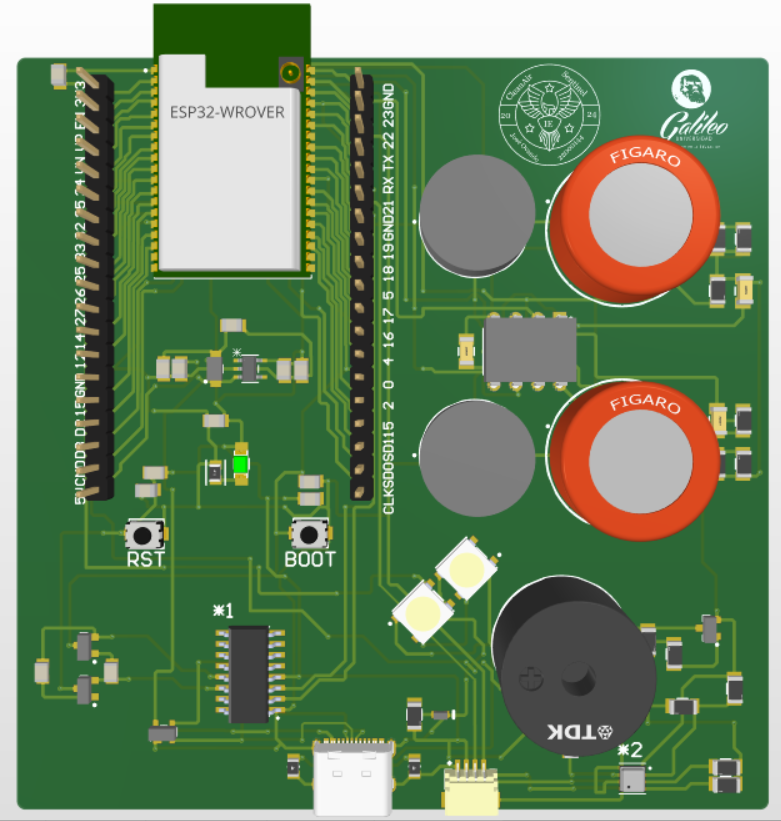
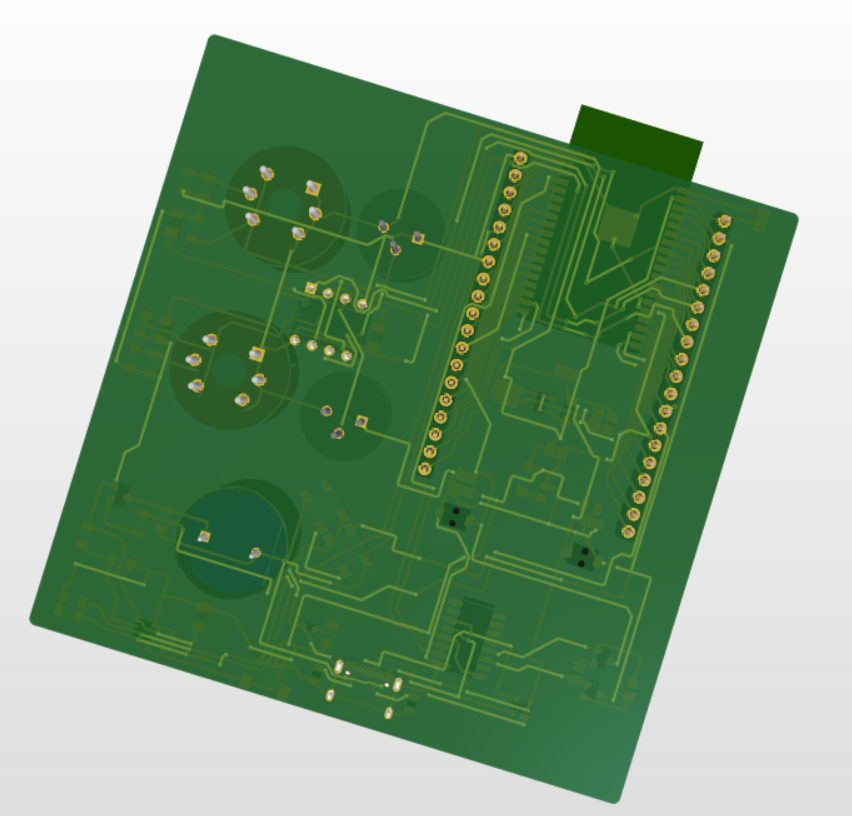
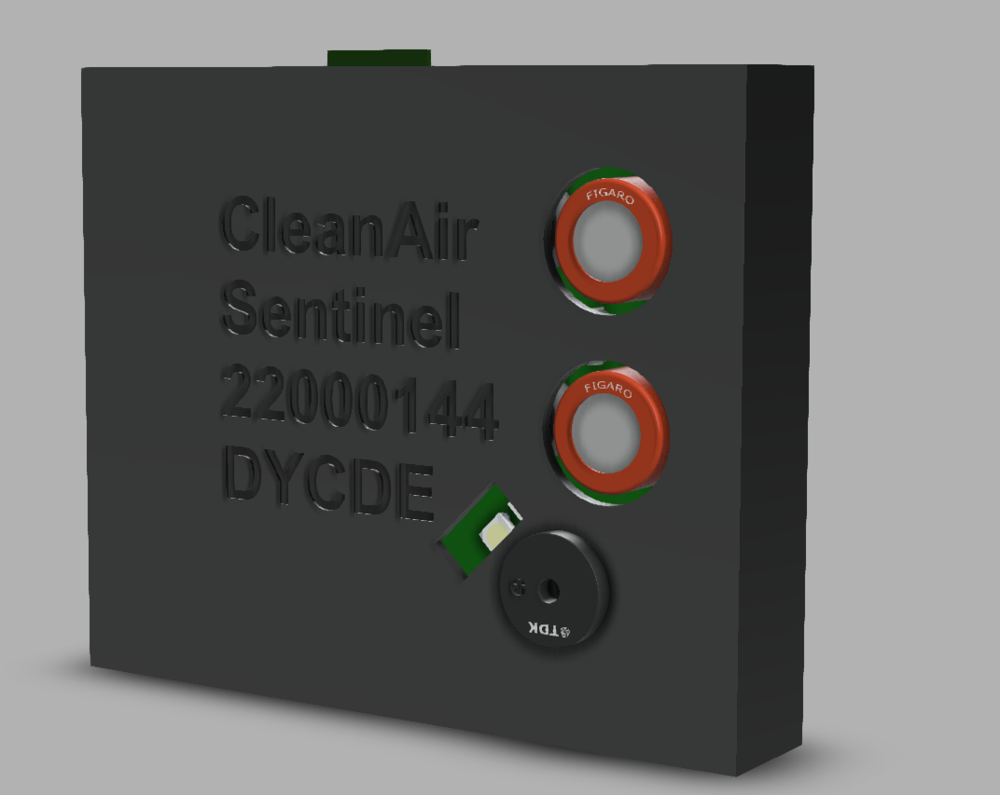

# Proyecto Final de DYCDE: Dispositivo IoT para Detección de Fugas de Gas

## Descripción del Proyecto
Este proyecto es un dispositivo de Internet de las Cosas (IoT) diseñado y ensamblado en Guatemala para la detección de fugas de gas. El objetivo principal es aumentar la seguridad en hogares y entornos industriales mediante la detección temprana de fugas de gas, alertando de manera efectiva a los usuarios. Este proyecto forma parte del programa final de DYCDE.

## Características Clave

- **Sensores MQ135 y MQ5**: Detectan diferentes gases, asegurando una amplia cobertura y precisión.
- **Conectividad IoT**: Utiliza Thinger.io para la visualización y monitoreo en tiempo real de los datos.
- **Alertas de WhatsApp**: Envía alertas a través de Twilio para notificaciones instantáneas.
- **Interfaz Visual**: NeoPixels y un buzzer proporcionan alertas visuales y sonoras.
- **Calibración y Precisión**: Configuración específica para cada sensor, garantizando lecturas precisas.

## Componentes Utilizados

- **ESP32**: Controlador principal del dispositivo.
- **MQ135 y MQ5**: Sensores para la detección de varios tipos de gases.
- **NeoPixels**: LEDs RGB para alertas visuales.
- **Buzzer**: Para alertas sonoras.
- **Conectividad Wi-Fi**: Para la integración con Thinger.io y Twilio.

## Pinout

| Componente | Pin ESP32 |
|------------|-----------|
| MQ135      | IO35      |
| MQ5        | IO34      |
| NeoPixel   | IO14      |
| Buzzer     | IO12      |
| SDA (BME680)| IO21     |
| SCL (BME680)| IO22     |

## Beneficios

- **Seguridad Mejorada**: Detección temprana y alerta instantánea de fugas de gas.
- **Acceso Remoto**: Monitoreo en tiempo real desde cualquier dispositivo con acceso a internet.
- **Notificaciones Inmediatas**: Alertas a través de WhatsApp aseguran que los usuarios estén informados rápidamente.
- **Diseño Local**: Desarrollado y ensamblado en Guatemala, adaptado a las necesidades locales y utilizando componentes accesibles.

## Imágenes del Proyecto

A continuación, se presentan imágenes del dispositivo y del sistema en funcionamiento:

- **PCB**
  
  

- **Encapsulado**
  

  ## Licencias

  - **Hardware License**: CERN Open Hardware License Version 2
  - **Software License**: GNU General Public License Version 3.0
  - **Documentation License**: CC BY 4.0 International

 

## Contacto e Información Adicional

Para más información sobre el proyecto o cualquier consulta, puedes contactarme a través de:

- **Correo Electrónico**: (jose.ovando@galileo.edu)
- **Video del funcionamiento**: (https://drive.google.com/file/d/15rmEYENk3Vo4_Iy1xjndv2ysT-Hsc_QC/view?usp=sharing)
